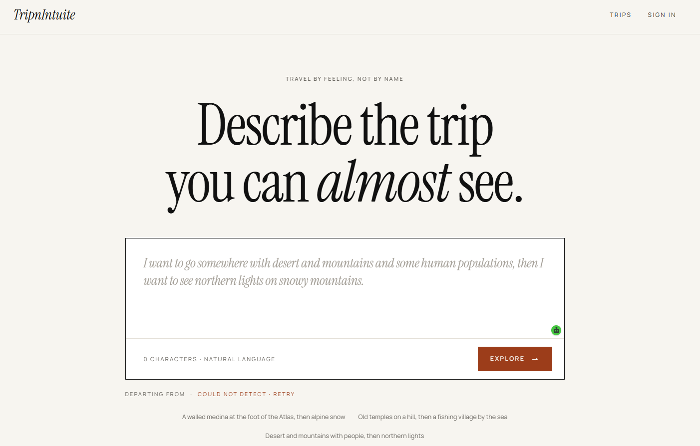

<div align="center">

# TripnIntuite

### Travel by feeling, not by name.

_Describe the trip you can almost see — TripnIntuite turns your travel intuitions into a multi-leg itinerary._



</div>

---

## ✨ What it is

TripnIntuite lets you describe a trip in plain language — _"somewhere with desert and mountains and some human populations, then northern lights on snowy mountains"_ — and an AI **Coordinator agent** turns that intuition into a concrete, multi-leg itinerary: real destinations, flights between legs, and hotels for each stop.

No dropdowns, no exact city names. Just the feeling of where you want to go.

## 🧭 Features

- **Natural-language trip planning** — write how the trip _feels_; the Coordinator agent parses it into ordered segments and matched real-world locations.
- **Multi-leg itineraries** — chained destinations with flights between legs and hotels per stop.
- **Flight & hotel search** — nearest-airport resolution, flight options, hotel listings with details, rates, and map view.
- **Sandbox booking** — prebook and book flights and hotels in a simulated/sandbox flow (no real charges).
- **Accounts & auth** — sign up, email verification, password reset, JWT-secured sessions.
- **Itinerary delivery** — confirmation email plus an `.ics` file to add the trip to your calendar.

## 🏗️ Tech stack

| Layer | Stack |
|-------|-------|
| **Web** (`apps/web`) | Next.js 16, React 19, TypeScript, Tailwind CSS v4, Zustand, react-simple-maps / d3-geo, Google Maps |
| **API** (`apps/api`) | Spring Boot 4, Java 21, Spring AI (Anthropic Claude), Spring Security + JWT, Spring Data JPA, Spring Mail |
| **Data** | PostgreSQL |
| **AI** | Anthropic Claude (Coordinator agent, natural-language parsing) |
| **Travel APIs** | LiteAPI (hotels), Duffel (flights) — sandbox mode |

## 📁 Project structure

```
.
├── apps/
│   ├── web/                 # Next.js frontend
│   └── api/                 # Spring Boot backend
│       └── src/main/java/com/abdullah/api/
│           ├── auth/        # signup, login, JWT, email verification
│           ├── trip/        # coordinator agent, flight & hotel search, booking
│           ├── email/       # confirmation emails + .ics calendar builder
│           ├── user/        # user domain
│           └── exception/   # global error handling
└── assets/                  # screenshots & media
```

## 🚀 Getting started

### Prerequisites

- Node.js 20+
- Java 21
- PostgreSQL
- API keys (see below)

### Backend — `apps/api`

```bash
cd apps/api
# create your env from the template and fill in values
cp .env.example .env
./mvnw spring-boot:run
```

The API runs on `http://localhost:8080`.

### Frontend — `apps/web`

```bash
cd apps/web
npm install
npm run dev
```

The web app runs on `http://localhost:3000`.

## 🔑 Environment variables

Backend (`apps/api/.env`):

```bash
# Database
DATABASE_URL=YOUR_API_KEY
DATABASE_USERNAME=YOUR_API_KEY
DATABASE_PASSWORD=YOUR_API_KEY

# AI
ANTHROPIC_API_KEY=YOUR_API_KEY

# External APIs
API_NINJA_API_KEY=YOUR_API_KEY
LiteAPI_API_KEY=YOUR_API_KEY

# Auth
JWT_SECRET_KEY=YOUR_API_KEY

# Email
SUPPORT_EMAIL=YOUR_API_KEY
APP_PASSWORD=YOUR_API_KEY

# Maps
GOOGLE_MAPS_API_KEY=YOUR_API_KEY
```

> **Note:** all keys are loaded from environment variables — never commit real keys to the repo.

## 🔌 Key API endpoints

| Method | Endpoint | Purpose |
|--------|----------|---------|
| `POST` | `/api/trip/parse` | Parse a natural-language prompt into trip segments |
| `GET`  | `/api/trip/nearest-airport` | Resolve nearest airport for a location |
| `GET`  | `/api/trip/flights` | Search flights for a leg |
| `GET`  | `/api/trip/hotels` | Search hotels for a stop |
| `GET`  | `/api/trip/hotels/{id}/details` | Hotel details |
| `GET`  | `/api/trip/hotels/{id}/rates` | Hotel rates |
| `POST` | `/api/trip/hotels/prebook` · `/hotels/book` | Hotel booking (sandbox) |
| `POST` | `/api/trip/flights/book` | Flight booking (sandbox) |

---

<div align="center">
<sub>Built with Next.js, Spring Boot, and Anthropic Claude · © 2026 TripnIntuite</sub>
</div>